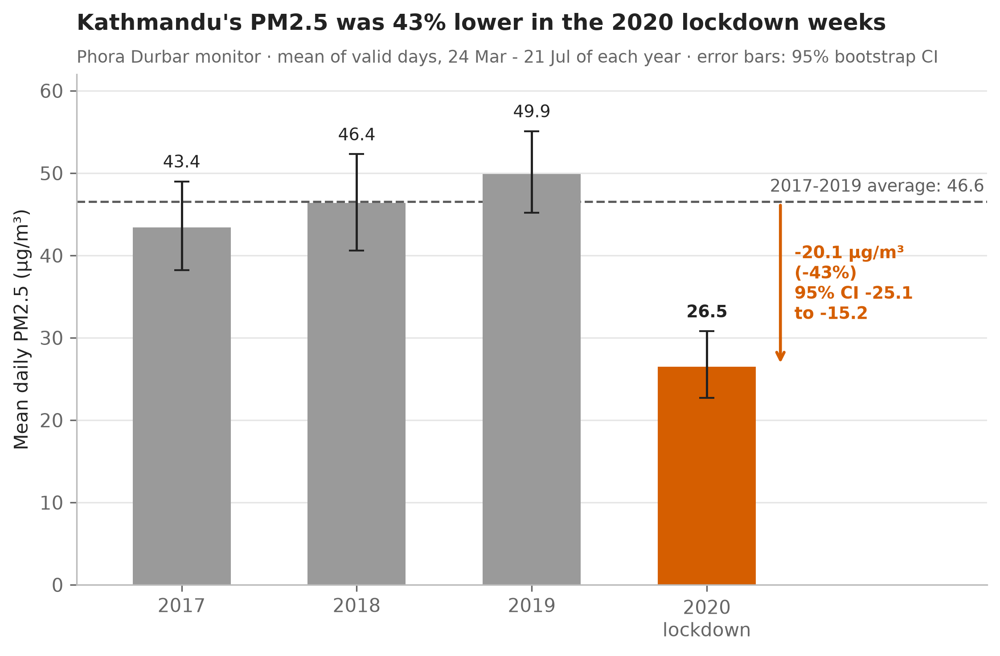
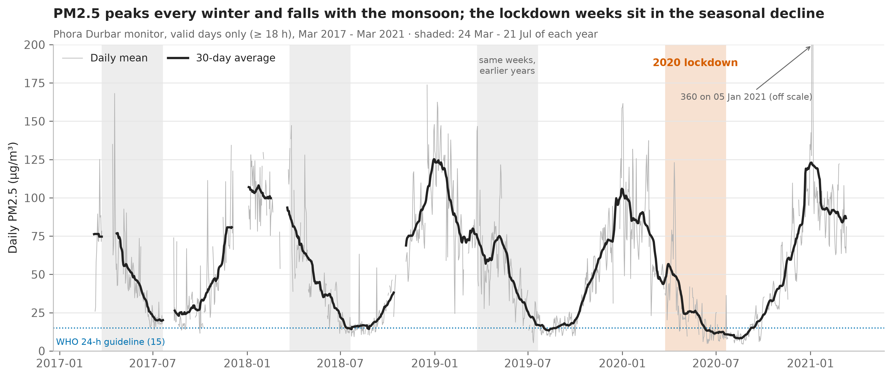
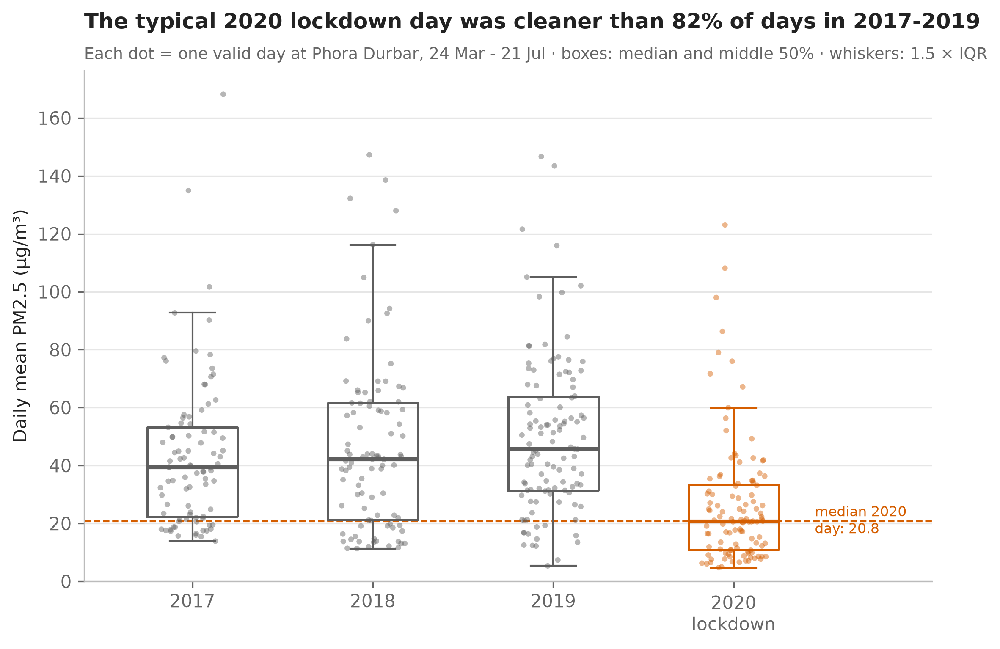
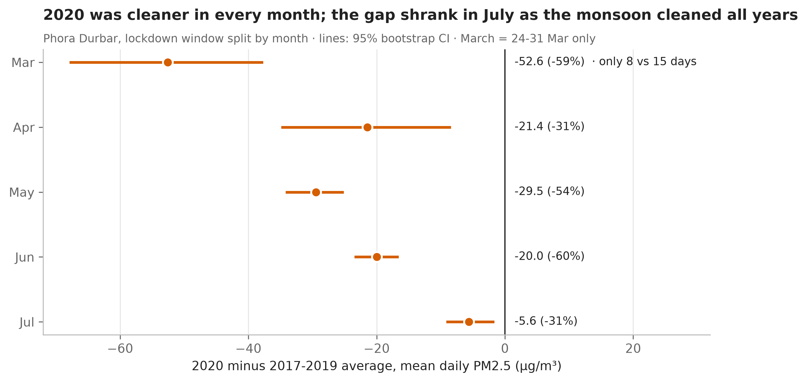
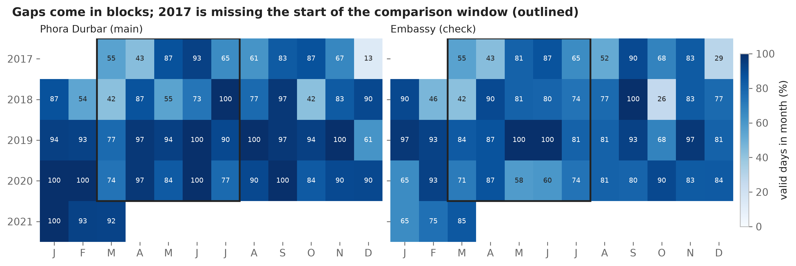
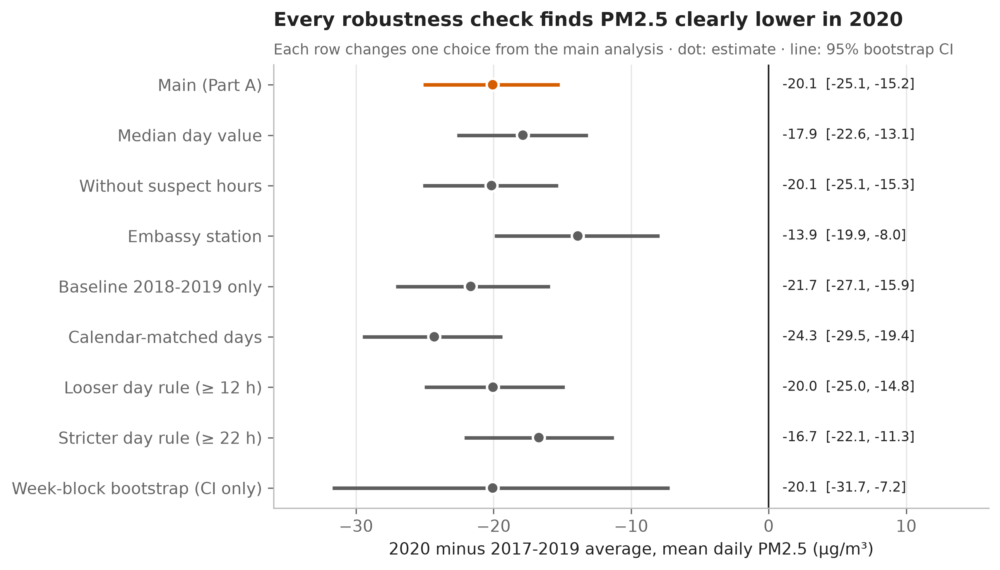
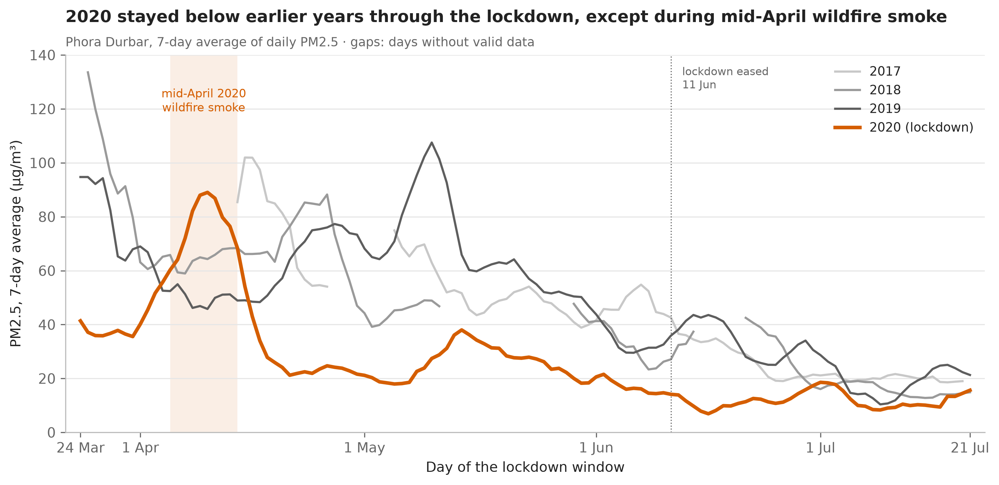

# Did Kathmandu's air get cleaner during the 2020 COVID lockdown?

An analysis of hourly PM2.5 from the two US Embassy air-quality monitors in Kathmandu, Nepal (March 2017 - March 2021).

## The question

During Nepal's 2020 COVID lockdown (from 24 March 2020), was Kathmandu's daily PM2.5 lower than in the same calendar weeks of 2017-2019, and by how much?

*Main number (fixed before the analysis):* the difference in mean daily PM2.5 between the 2020 lockdown weeks and the average of the same weeks in 2017-2019, in µg/m³, with a bootstrap 95% confidence interval (resampling days, seed 42).

## The answer

**Yes. During the lockdown weeks (24 March - 21 July 2020), mean daily PM2.5 at the Phora Durbar monitor was 26.5 µg/m³, against 46.6 µg/m³ in the same weeks of 2017-2019: 20.1 µg/m³ lower (95% CI 15.2 to 25.1), a 43% drop (95% CI 33% to 52%).**

The drop appears in every month of the lockdown and in all nine robustness checks (estimates from 13.9 to 24.3 µg/m³ lower, every 95% CI below zero). Because consecutive days are strongly linked, a more cautious week-block bootstrap gives a wider interval (7.2 to 31.7 µg/m³ lower), which still excludes zero: the **direction** is solid, the exact **size** less so.



## How to run it

You need Python 3.12 (tested with 3.12.4) and about 50 MB of disk space. From a terminal in the project folder:

```
py -m venv .venv                      (Mac/Linux: python3 -m venv .venv)
.venv\Scripts\activate                (Mac/Linux: source .venv/bin/activate)
pip install -r requirements.txt
python src/download_data.py
jupyter notebook
```

Then open `notebooks/01_data_quality_and_cleaning.ipynb` and choose **Kernel → Restart & Run All**; then do the same for `notebooks/02_analysis_and_figures.ipynb`. Notebook 01 takes about 30 seconds, notebook 02 about a minute.

**What success looks like**
- `download_data.py` prints `checksum OK` for both files.
- Notebook 01 saves `data/processed/pm25_hourly_clean.csv` (57,202 rows) and `data/processed/pm25_daily.csv` (2,944 rows).
- The last cell of notebook 02 prints:
  `Final answer: 2020 lockdown weeks minus 2017-2019 same weeks = -20.1 µg/m³ (95% CI -25.1 to -15.2), -43.1%`
- The seven PNG files in `figures/` are re-created.

If the download fails (no internet, or the portal has moved), follow the manual steps in [data/README.md](data/README.md).

## Data

| | |
|---|---|
| Source | [Air Quality Data in Kathmandu](https://opendatanepal.com/dataset/air-quality-data-in-kathmandu), Open Data Nepal (Open Knowledge Nepal); original measurements by the US Department of State (US Diplomatic Post monitors) |
| Licence | CC BY-SA |
| Downloaded | 6 October 2026 (files checked by SHA-256) |
| Files | `kathmandu_embassy.csv` (60,779 rows), `kathmandu_phora_durbar.csv` (61,976 rows) |
| One row | one station × one hour × one pollutant (PM2.5 in µg/m³, or ozone in ppm) |
| Period | 3 March 2017 - 13 March 2021, Nepal time (UTC+05:45) |

Column descriptions, missing-value codes and the download links are in [data/README.md](data/README.md). Raw data isn't committed; `src/download_data.py` fetches it.

**Lockdown dates:** nationwide lockdown from 24 March 2020, eased on 11 June, lifted at midnight on 21 July 2020 ([The Kathmandu Post, 21 July 2020](https://kathmandupost.com/national/2020/07/21/government-decides-to-lift-the-four-month-long-coronavirus-lockdown-but-with-conditions); [Nepali Times, 21 July 2020](https://nepalitimes.com/nepal-ends-covid-19-lockdown)).

## Cleaning decisions

The rules were decided from the data-quality report in notebook 01, **before** any lockdown comparison.

| # | Step | Why | Rows before | Rows after |
|---|---|---|---|---|
| 1 | Keep PM2.5 rows only | The question is about PM2.5; ozone is a different pollutant in different units | 122,755 | 63,210 |
| 2 | Drop exact duplicate rows | Identical rows add no information (none found; logged to show it was checked) | 63,210 | 63,210 |
| 3 | Drop `-999` rows | Publisher's placeholder for "no reading": the hour is missing | 63,210 | 57,426 |
| 4 | Drop other negative values (-1 to -15) | A concentration can't be negative: sensor error | 57,426 | 57,202 |
| 5 | Parse local time; add date and station | Daily means must use Nepal calendar days (UTC+05:45), not UTC days | 57,202 | 57,202 |
| 6 | Flag isolated spikes and the 985 µg/m³ ceiling as `is_suspect` (kept) | 53 one-hour spikes (≥ 300 with both neighbouring hours < ⅓ of it) and 35 readings at the instrument maximum: probably glitches, but not certain, so flagged and tested in a robustness check rather than deleted | 57,202 | 57,202 (64 flagged) |
| 7 | Daily table: a day counts only with **≥ 18 of 24** valid hours | A day with a few readings (e.g. only night hours) isn't a reliable daily average | 57,202 hours | 2,944 station-days (1,118 valid at Embassy, 1,202 at Phora Durbar) |

## Method

- **Station:** Phora Durbar (central Kathmandu) is the main station: it has 112 of 120 valid days in the 2020 window, against 84 at the Embassy monitor. Embassy is a robustness check. The stations aren't averaged, because they read at different levels (Phora Durbar about 8 µg/m³ higher) and gaps at one would shift an average.
- **Window:** 24 March - 21 July (120 days), the same calendar days in 2017, 2018, 2019 and 2020. PM2.5 falls steeply from spring to the monsoon every year, so comparing the same dates removes most of the seasonal effect.
- **Unit:** daily mean PM2.5 on valid days (≥ 18 valid hours).
- **Main number:** the 2020 mean of daily means minus the baseline, where the baseline is the average of the 2017, 2018 and 2019 means (each year weighted equally).
- **95% confidence interval:** bootstrap with 2,000 resamples (seed 42). Days are resampled with replacement **within each year**, keeping each year's number of days. Days, not hours, are resampled because hours within a day aren't independent.
- **Supporting test:** a permutation test (5,000 shuffles of the year labels) gives p < 0.001.
- **Honesty check:** daily PM2.5 is strongly autocorrelated (lag-1 correlation 0.71-0.90), which makes a day bootstrap too narrow, so a week-block bootstrap (resampling 7-day blocks) is reported too.
- **Robustness:** the whole estimate is re-run with one choice changed at a time (table below).

## Results


**Figure 2.** The full daily record: a strong yearly cycle, with winter peaks above 100 µg/m³ and monsoon lows near the WHO 24-hour guideline. The comparison weeks (shaded) always fall in the spring-to-monsoon decline, which is why the analysis compares the same calendar weeks across years.


**Figure 3.** The whole distribution moved down, not only the mean: the median 2020 lockdown day (20.8 µg/m³) was cleaner than 82% of days in the same weeks of 2017-2019.


**Figure 4.** The drop holds in every month: about 20-30 µg/m³ from April to June, and 5.6 µg/m³ in July, when monsoon rain cleans the air in every year and the lockdown was being eased.


**Figure 5.** Data coverage: most months are 90-100% complete, but 2017 is missing much of late March and April (the dirtiest part of the window), and the Embassy monitor is missing much of May-June 2020.


**Figure 6.** All nine robustness checks find a clear drop, with every 95% CI below zero.


**Figure 7.** Day by day, 2020 stayed below the earlier years for almost the whole window. The exception is 5-14 April 2020, when smoke from wildfires in surrounding districts reached the valley even with traffic stopped ([Nepali Times, 1 Sep 2020](https://nepalitimes.com/nepal-sees-drop-in-wildfires-during-lockdown)).

## Robustness

Each row changes **one** choice from the main analysis. Differences are 2020 minus the 2017-2019 average, in µg/m³.

| Check | What changes | 2020 days | Difference | 95% CI | Change |
|---|---|---|---|---|---|
| **Main** | - | 112 | **−20.1** | **−25.1 to −15.2** | **−43%** |
| Median day value | median of each day's hours instead of the mean | 112 | −17.9 | −22.6 to −13.1 | −41% |
| Without suspect hours | flagged spikes and 985 readings removed | 112 | −20.1 | −25.1 to −15.3 | −44% |
| Embassy station | the other monitor | 84 | −13.9 | −19.9 to −8.0 | −33% |
| Baseline 2018-2019 only | drop 2017 (missing early April) | 112 | −21.7 | −27.1 to −15.9 | −45% |
| Calendar-matched days | only dates with data in all four years | 56 | −24.3 | −29.5 to −19.4 | −58% |
| Looser day rule | ≥ 12 instead of ≥ 18 valid hours | 117 | −20.0 | −25.0 to −14.8 | −43% |
| Stricter day rule | ≥ 22 instead of ≥ 18 valid hours | 103 | −16.7 | −22.1 to −11.3 | −38% |
| Week-block bootstrap | resample 7-day blocks (CI only) | 112 | −20.1 | −31.7 to −7.2 | −43% |

- **The direction never changes:** every check finds a clear drop, and every interval excludes zero.
- **The main number is, if anything, conservative.** 2017 is missing the most polluted part of its window, which makes the baseline too low; removing 2017 or comparing only matched calendar days gives a bigger drop.
- **The Embassy monitor shows a smaller drop.** About half of that difference comes from Embassy's missing May-June 2020 days. On the 81 days in 2020 when both monitors have data, the drop is 17.7 µg/m³ (−37%) at Phora Durbar and 13.7 (−33%) at the Embassy: a small real difference, consistent with traffic being a bigger share of pollution in the city centre.

## Conclusion

In the 2020 lockdown weeks, Kathmandu's daily PM2.5 at the Phora Durbar monitor was about **20 µg/m³ (43%) lower** than in the same weeks of 2017-2019 (95% CI 15.2 to 25.1 µg/m³). The drop holds in every month and under every alternative choice tested, though its exact size is less certain than the main interval suggests (roughly 7 to 32 µg/m³ when the day-to-day linkage is taken into account). In plain words: during the lockdown, central Kathmandu's air carried roughly 40% less fine-particle pollution than in a normal year at the same time of year. It was still above the WHO 24-hour guideline (15 µg/m³) on average, and wildfire smoke still caused bad days.

## Limitations

1. **A difference, not proof of cause.** The analysis shows PM2.5 was lower in 2020; it can't show that the lockdown alone caused all of the drop. Anything else that differed in spring 2020 is mixed in.
2. **Weather isn't controlled.** Rain, wind and the timing of the monsoon vary from year to year and strongly affect PM2.5. An early or wet pre-monsoon in 2020 would lower PM2.5 by itself. No weather data is used here.
3. **Wildfires and regional pollution.** Spring forest fires and haze from outside the valley vary by year. Mid-April 2020 shows smoke can raise PM2.5 even with traffic stopped, so fire seasons differing between years could push the difference either way.
4. **One monitor, one place.** Phora Durbar describes central Kathmandu, not the whole valley. The second monitor agrees on the direction but shows a smaller drop (−33% vs −43%).
5. **Missing data.** 2017 is missing late March to mid-April (biasing its baseline low), Embassy is missing much of May-June 2020, and days with fewer than 18 valid hours are excluded. The checks suggest these gaps make the main number conservative rather than inflated, but they add uncertainty.
6. **The size depends on how uncertainty is measured.** Days are strongly autocorrelated, so the day-bootstrap CI (15.2 to 25.1) is optimistic; the week-block CI (7.2 to 31.7) is the more cautious range.
7. **Short baseline and partial lockdown.** Only three comparison years are available (the data starts in March 2017), and from 11 June 2020 the lockdown was partly eased, so the later weeks weren't a full lockdown.

## Project structure

```
Kathmandu-lockdown-air-quality/
├── README.md                 <- this file: question, answer, how to run, limitations
├── LICENSE                   <- MIT (code); the data is CC BY-SA (see data/README.md)
├── requirements.txt          <- package versions used
├── data/
│   ├── README.md             <- source, licence, columns, checksums
│   ├── raw/                  <- downloaded CSVs, never edited (not in Git)
│   └── processed/            <- cleaned outputs of notebook 01 (not in Git)
├── notebooks/
│   ├── 01_data_quality_and_cleaning.ipynb   <- data-quality report and cleaning log
│   └── 02_analysis_and_figures.ipynb        <- main number + CI, robustness, figures
├── src/
│   ├── download_data.py      <- downloads and checksum-verifies the raw data
│   └── plotting_utils.py     <- chart style and save() at 300 dpi
└── figures/                  <- the seven PNGs shown above
```

## Reproducibility

- Python 3.12.4 with pandas 3.0.6, numpy 2.5.3, matplotlib 3.11.2, jupyter 1.1.1 (`requirements.txt`).
- Every random step uses a fixed seed (`SEED = 42`): 2,000 bootstrap resamples, 5,000 permutations, 2,000 week-block resamples. Re-running gives identical numbers.
- Raw files are verified by SHA-256 in `src/download_data.py`; all paths are relative to the project folder.

## Credits

Data: "Air Quality Data in Kathmandu", Open Data Nepal / Open Knowledge Nepal, CC BY-SA; measurements by the US Department of State Diplomatic Post monitors in Kathmandu. Analysis by Yugal Poudel ([@Yugalpoudel07](https://github.com/Yugalpoudel07)).
